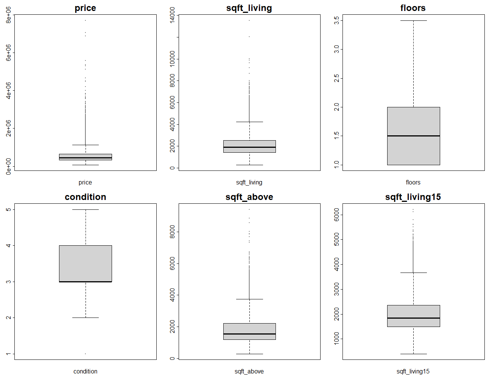

# House Price Analysis and Prediction

This repository contains an R project for analyzing and predicting house prices using multiple statistical and machine learning techniques. The project demonstrates data preprocessing, exploratory data analysis, visualization, and linear regression modeling.

---

## Features

- **Data Preprocessing**:
  - Handles missing values by dropping incomplete rows.
  - Removes duplicate rows to ensure data integrity.

- **Exploratory Data Analysis (EDA)**:
  - Computes correlation among features and visualizes it with a heatmap.
  - Provides descriptive statistics, including mean, median, and interquartile range.

- **Visualization**:
  - Generates histograms, boxplots, and pairwise scatter plots for feature exploration.

- **Linear Regression Modeling**:
  - Splits the data into training and testing sets.
  - Builds a linear regression model to predict house prices.
  - Evaluates the model using R², RMSE, and MAE metrics.

---

## Outputs
### Visualizations

#### Correlation Heatmap
The correlation heatmap shows the relationships between different features in the dataset.

---

#### Histograms
The histograms depict the distribution of each feature in the dataset.

---

#### Boxplots
The boxplots highlight the spread and potential outliers for each feature.

---

#### Pairwise Scatter Plots
The pairwise scatter plots show relationships between each pair of features.

### Model Outputs
  - Linear regression coefficients (`linreg_coef.csv`)
  - Model evaluation metrics (`linreg_error.csv`)
